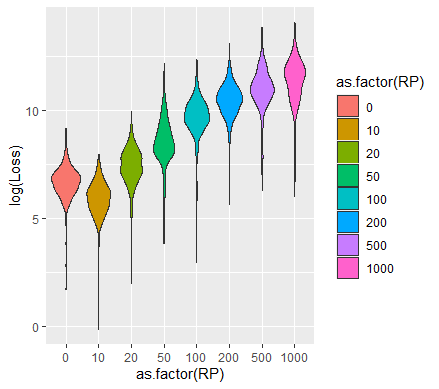

```{r setup, include=FALSE}
knitr::opts_chunk$set(echo = TRUE)
```

## Introduction

FEMA collects natural hazards -- flood, hurricane, earthquake, tsunami -- for deterministic events -- such as Katrina, Sandy, Harvey hurricanes, Northridge earthquake to name a few -- and probabilistic from 10 year to 1000 year probability of occurrence, which we will call return periods (RPs). This AALinR module assumes the existence of  several (more than 1) probabilistic data points, for the time being, in the predefined RPs [10, 25, 50, 100, 200, 500, 1000], but in the future extendable to any random RP. The import data in space-delimited format is: (ID RP Loss) [@HazCan:2013]. The AAL is a valuable risk assessment tool that presents loss estimates in dollar values. In a hazard mitigation plan, the AAL can be used to improve the risk assessment, and to select, evaluate, and prioritize mitigation measures [@FEMArVII:2014].

The AALinR [@Todorov:2020] will produce the Average Annualized Loss using Riemann numerical integration midpoint method [@RietmannMethod:2020]. 


## Methodology

### Computational Modeling

The Flood Risk Report and Flood Risk Database include loss estimates from the Federal Emergency Management Agency (FEMA)’s Hazus model, presented as Average Annualized Loss (AAL) estimates expressed in dollar values. The estimates included in these products come from a nationwide model called Hazus, a Geographic Information Systems (GIS)-based planning tool that estimates structural, economic, and social losses resulting from flood, earthquake, and wind events. The information in the AAL can be used to identify floodprone areas, communicate flood risk, provide potential damage severity information for various flooding events, and identify possible locations for mitigation action. Pairing the AAL with local information helps enhance risk awareness and support mitigation planning efforts [@SchweitzerAndBerman]. 

### Current assumptions

- RPs must be one of [10, 20, 50, 100, 200, 500, 1000].
- No missing RP or outlier data detection.

### Future enhancements

- Random RP losses.
- missing, erroneous, outlier data detection/correction.


 - *Morphology of the heart.* Parameters associated with morphology which possibly influence flow include the tube's relative resting diameter and length the mechanical properties of the myocardium and surrounding structures, and the resistivity of the circulatory system. These morphological features show variation among animals within the Chordata but the role of such features in functional performance is not well understood. 
 - *Kinematics of tube compression.* The frequency of compressions can have a complicated, non-linear relationship with flow speeds. Compression ratio, the percent occlusion of the tube, can affect flow speeds in non-linear ways. Feedback between the action potentials and mechanical properties of the myocardium also impact flow features.
 - *Size and scaling.* Fluid flow undergoes a critical transition between small sizes and speeds, where the viscosity of fluid damps out unsteady effects, to large sizes and speeds, where inertia is relatively more influential to the character of fluid flow than viscosity and unsteady effects are important. For pulsatile flow, a ratio between inertial and viscous forces is called the Womersley number ($Wo$) and helps to define the transition (at $Wo\approx1$):
\begin{equation}
Wo = d\sqrt{\frac{f \rho}{\mu}},
\label{Wo}
\end{equation}
where $f$ is the frequency of the pulse, $d$ is the resting diameter of the tube, $\mu$ is fluid dynamic viscosity, and $\rho$ is fluid density. Embryonic vertebrates possess circulatory systems that grow through this transitional range with tubular hearts that transform into chambered hearts with valves during development. Other groups of animals explore size through evolutionary time, retaining a tubular heart throughout their lives. 

### Study Objectives

We constructed two-dimensional models of peristalsis in a heart tube which drive flow through a closed racetrack circulatory system. We then constructed a surrogate to replace the full input space of the CFD model using gPC expansion. Using sensitivity analysis, we explore the interactive effects on performance outputs (flow in the system, work, and cost of transport) of morphology, kinematics, and size through three input parameters: the dimensionless Womersley number $Wo$  (eq. \ref{Wo}), compression ratio of the tube $CR$, and compression frequency $f$ with constant wave speed. Based on these results, we make conclusions about the diversity of these parameters in extant groups of animals with peristaltically driven circulatory flow.

## Results

```{r grid-fig, echo=FALSE, fig.cap="Racetrack model showing adaptive meshing. Full racetrack showing the $R_{top}$ and $R_{bot}$ used to generate prescribed motion in red and adaptive meshing of domain: roughest mesh (32 x 32 grid) in dark blue, intermediate mesh (16 x 16 grid) in teal, and finest mesh (8 x 8 grid) in gold, black box highlights inset a. Inset a: close up of region including part of the tube and racetrack showing meshes, black box highlights inset b. Inset b: close up of tube showing relation of finest mesh and target points of the racetrack. ", out.width = '100%'}

```

The elastic region had a 4:1 length:diameter ratio  with the inner 3/4 of the tube length consisting of points tethered to target points, which drove the preferred peristaltic motion (Fig. \ref{fig:grid-fig}). The rest of the racetrack were tethered to target points which remained still throughout the simulations. Target point stiffness ($k_{targ}$) was chosen as 30.0 to remain consistent with the model.

The force equation used to drive peristalsis in the model is: 
\begin{equation}
\mathbf{f}(r,t) = k_{targ}(\mathbf{Y}(r,t) - \mathbf{X}(r,t))
\label{eq:f}
\end{equation}
where $\mathbf{Y}(r,t)$ is the preferred position of the boundary. Only the preferred motion of the boundary in each model of peristalsis differed. Each model of driving peristalsis is described below. 

#### Opposing sine-wave peristalsis model

The sine-wave model defines the motion of the boundary as two opposing sine waves:
\begin{equation}
y_{top,bot} = R_{top,bot} \pm A \sin(2\pi f t+ 2\pi cx_t)
\label{eq:sinewaves}
\end{equation} 
where $f$ is the compression frequency, $c$ is the compression-wave speed (held constant throughout the study at a non-dimensional speed of 3.0), $A$ is the amplitude of the contraction, and $x_t$ is the horizontal distance from the beginning of the prescribed motion section. The compression ratio gives the percent occlusion and is equal to $2A$. The peristaltic waves created by Eq.~\ref{eq:sinewaves} propagated from left to right, therefore driving fluid flow counter-clockwise in the lumen of the racetrack. The stiffness of the boundary and target point stiffness ($k_{targ}=30.0$) allowed for very little independent elastic motion in the peristaltic region of the tube.

#### Opposing Gaussian-peak peristalsis model

The pinch model defines the motion of the boundary as two sharp, Gaussian peaks, with the remainder of the boundary being free to flex with little restriction by the target points: 
\begin{equation}
y_{top,bot} = R_{top,bot} \pm A\exp((-0.5(x_t-\gamma)/\sigma)^2)
\label{eq:gaussianwaves}
\end{equation}
Where $\gamma$ is the position of the pinch on the x-axis of the center of the tube and $\sigma$ is the width of the pinch. The pinch was advanced by altering $\gamma$ depending on the time step of the simulation. For the points within the region of the Gaussian wave, the target point stiffness was chosen to be extremely stiff ($k_{targ}=2500$) so that the target points adhered closely to the programmed waveform. Outside the peak region, the target points were tethered very loosely ($k_{targ}=0.7$) with a spring constant about two orders of magnitude stiffer to allow for elastic interactions between fluid and the heart tube.


### Analysis of Flow and Pressure Fields

Several calculations of non-dimensional fluid flow and pressure were made for each simulation in *R* [@R:2011]. Positive flow speeds indicate fluid motion in the counter-clockwise direction in the racetrack, the same direction as the traveling peristaltic wave. All values presented in the analysis are dimensionless, and more information about nondimensionalizing values can be found in the supplemental information to this paper. 

At each time step in the simulation, the magnitude of dimensionless fluid velocity was recorded and then spatially averaged across each area to find $|\mathbf{u'}|$ across four rigid sections of the racetrack: the upper position, a connecting vertical position, the inflow region (vena cava) and outflow region (aorta). The mean speeds $|\mathbf{u'}|$ were then temporally averaged to find the average flow speed across each simulation ($U_{avg}$). The maximum value of flow speed, $\mathbf{u'_{m}}$, was also taken at each time step, and the maximum of these in a simulation represents the peak flow speed ($U_{peak}$). 

Non-dimensional pressure was also recorded for each time step of the simulation and spatially averaged at each time step near the inflow area (vena cava position) and the outflow area (aorta position) of the elastic region. For each simulation, the vena cava and aorta positions' pressures were averaged temporally to find $p_{in}$ and $p_{out}$, respectively. Each inflow pressure was subtracted from the outflow pressure at each time step to find their difference, and these differences were averaged over simulation time to find $\Delta P$. 


## FAQ 

Q: How is AAL different from the 1 return period (RP) loss?
A: The AAL is the mean value of a loss exceedence probability (EP) distribution. It is the expected loss per year, averaged over many years. The one-year return period loss has 100% chance of occurrence and is expected to be at least equaled every year.

Q: What is the RP loss relationship w.r.t. the probability of occurrence?
A: The RP loss has inverse relationship w.r.t. probability of occurrence. For example 100-year RP loss is said to equal 1/100 or 1% chance. Similarly, 10-year ~ 1/10 or 10% chance, 25-year ~ 1/25 or 4% chance, 500-year ~ 1/500 or 0.2% chance of occurrence.

Q: Why AAL? 
A: because it is a good measure for relative natural hazards risk of a geographic area.

Q: What is the ID? 
A: it could be a Census Block (CB), Census Tract (CT), County (CO), State (ST), or individual buildings, for which may have to use Google Plus codes.


## References 

