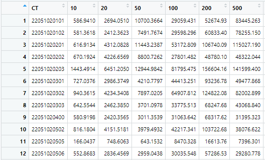
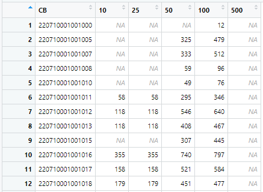

```{r setup, include=FALSE}
knitr::opts_chunk$set(echo = TRUE)
```

## Introduction

FEMA collects natural hazards -- flood, hurricane, earthquake, tsunami -- for deterministic events -- such as Katrina, Sandy, Harvey hurricanes, Northridge earthquake to name a few -- and probabilistic data points from 10 year to 1000 year probability of occurrence, which we will call return periods (RPs). This AALinR module assumes the existence of  several (more than 1) probabilistic data points, for the time being, in the predefined RPs [10, 25, 50, 100, 200, 500, 1000], but in the future to be extended to any random RP. The import data is in 3rd normal form (3NF) in space-delimited format as (ID RP Loss) [@HazCan:2013]. The AAL is a valuable risk assessment method that presents loss estimates in dollar values. In a hazard mitigation plan, the AAL can be used to improve the risk assessment, and to select, evaluate, and prioritize mitigation measures [@FEMArVII:2014].


## Methodology

### Computational Modeling

The AALinR [@Todorov:2020] largely following the catastrophe modeling practices by computing the Average Annualized Loss using Riemann numerical integration midpoint method [@RietmannMethod:2020]. 

The Natural Hazards Risk Report and Flood Risk Database include loss estimates from the Federal Emergency Management Agency (FEMA)’s Hazus model, presented as Average Annualized Loss (AAL) estimates expressed in dollar values. The estimates included in these products come from a nationwide model called Hazus, a Geographic Information Systems (GIS)-based planning tool that estimates structural, economic, and social losses resulting from flood, earthquake, hurricane and tsunami events. The information in the AAL can be used to identify natural hazards-prone areas, communicate that risk, provide potential damage severity information for various natural hazard events, and identify possible locations for mitigation action. Pairing the AAL with local information helps enhance risk awareness and support mitigation planning efforts [@SchweitzerAndBerman]. 

Two datasets were selected for the AALinR [@Todorov:2020] prototype. 

- *LA6* a suite of return period hurricane losses at Census Tract (CT) level for the six Louisiana parishes around New Orleans, namely: Saint Bernard, Saint Charles, Saint Tammany, Jefferson, Plaquemines, and New Orleans parishes (352 CTs, 2,464 CT RPs).

- *NOLA* a suite of return period flood losses at Census Block (CB) level for the city of New Orleans, LA (5,064 CBs, 20,684 CB RPs).

The AAL method calculates the Riemann midpoint sums, essentially performing numerical integration under the loss curve as defined by the provided return periods. Each return period loss is multiplied by the probability of occurrence of its return period. The sum of all products for the available return periods is the value for the AAL.

### Current assumptions

- RPs must be one of [10, 20, 50, 100, 200, 500, 1000].
- No missing RP or outlier data detection.

### Future enhancements

- Random RP losses.
- missing, erroneous, outlier data detection/correction.
- add spatial thematic mapping by state, by county, by census tract, and possibly by census block.

## Results

```{r la6-wide-fig, echo=FALSE, fig.num=1, fig.cap="The non-3NF (wide) input of hurricane losses of the 6 parishes around New Orleans, LA by census tract, by return period. ", out.width = '100%'}

```


The *LA6* hurricane loss dataset is an almost complete dataset with no blanks/missing data, because it is based on Census Tracts (CT) which are almost certainly guaranteed to contain a non-enpty Census Blocks (CB) in terms of building exposure. Such completeness makes LA6 easy to compute the AAL utilizing the Rietmann sums numerical integration.  (Fig. \ref{fig:la6-wide-fig}1)

```{r nola-wide-fig, echo=FALSE, fig.num=2, fig.cap="The wide input of flood losses of the city of New Orleans, LA at a much finer level by census block, by return period shows the scarcity in the loss matrix. These misses require dynamic range computations that proved to be difficult to accomplish for the duration of CS-510 and thus have been left out.", out.width = '100%'}

```


The *NOLA* flood loss dataset is sparse as compared to the *LA6* hurricane loss one. Considering such sparsity and ensuing consequent complexity of dynamic range numerical integration using the Rietmann sums the development of AAL methodology for NOLA dataset is considered out-of-scope for the purposes of CS-510. (Fig. \ref{fig:nola-wide-fig}2)


```{r all-rp-fig, echo=FALSE, fig.num=3, fig.cap="A violin log plot of the hurricane losses of the 6 parishes around New Orleans, LA by return period. The Aveage Annualized Loss (AAL) is labeled with 0. ", out.width = '100%'}
knitr::include_graphics("../fig/Rplot.png")
```

Visibly, the AAL are between 10~ and 20-year return period losses. (Fig. \ref{fig:all-rp-fig}3). 

## FAQ 

- *Q*: Why AAL? 
- *A*: because it is a good measure for relative natural hazards risk of a geographic area.

- *Q*: How is AAL different from the 1-year return period (RP) loss?
- *A*: The AAL is the mean value of a loss exceedence probability (EP) distribution. It is the expected loss per year, averaged over many years. The one-year return period loss has 100% chance of occurrence and is expected to be at least equaled every year.

- *Q*: What is the RP loss relationship w.r.t. the probability of occurrence?
- *A*: The RP loss has inverse relationship w.r.t. probability of occurrence. For example 100-year RP loss is said to equal 1/100 or 1% chance. Similarly, 10-year ~ 1/10 or 10% chance, 25-year ~ 1/25 or 4% chance, 500-year ~ 1/500 or 0.2% chance of occurrence.

- *Q*: What is the ID? 
- *A*: it could be a Census Block (CB), Census Tract (CT), County (CO), State (ST), or individual buildings, for which may have to use Google Plus codes.


## References 

